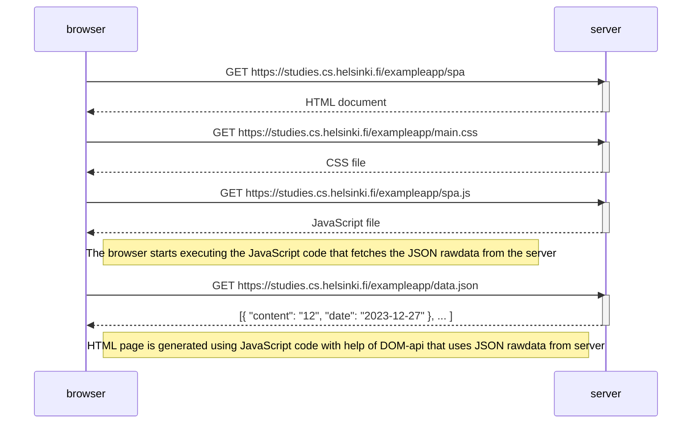

```mermaid
sequenceDiagram
    participant browser
    participant server
    
    browser->>server: GET https://studies.cs.helsinki.fi/exampleapp/spa
    activate server
    server-->>browser: HTML document
    deactivate server
    
    browser->>server: GET https://studies.cs.helsinki.fi/exampleapp/main.css
    activate server
    server-->>browser: CSS file
    deactivate server
    
    browser->>server: GET https://studies.cs.helsinki.fi/exampleapp/spa.js
    activate server
    server-->>browser: JavaScript file
    deactivate server
    
    Note right of browser: The browser starts executing the JavaScript code that fetches the JSON rawdata from the server
    
    browser->>server: GET https://studies.cs.helsinki.fi/exampleapp/data.json
    activate server
    server-->>browser: [{ "content": "12", "date": "2023-12-27" }, ... ]
    deactivate server

    Note right of browser: HTML page is generated using JavaScript code with help of DOM-api that uses JSON rawdata from server
```
