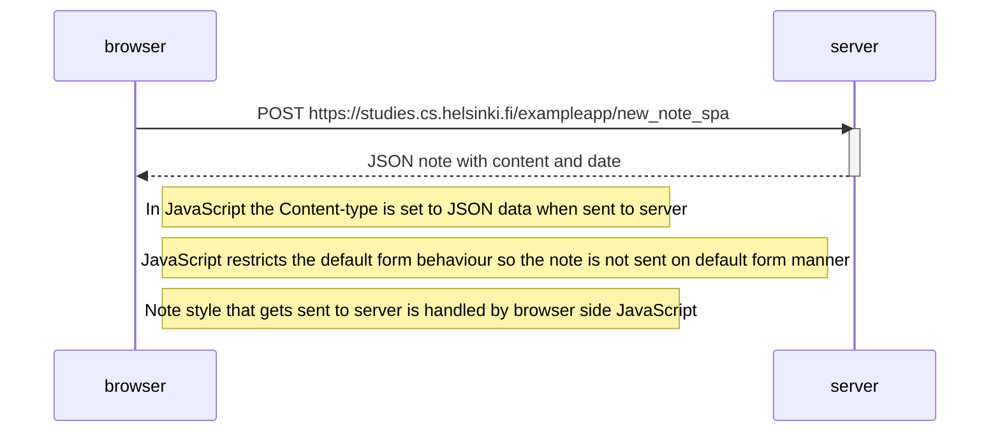

```mermaid
sequenceDiagram
    participant browser
    participant server
    
    browser->>server: POST https://studies.cs.helsinki.fi/exampleapp/new_note_spa
    activate server
    server-->>browser: JSON note with content and date
    deactivate server

    Note right of browser: In JavaScript the Content-type is set to JSON data when sent to server
    Note right of browser: JavaScript restricts the default form behaviour so the note is not sent on default form manner
    Note right of browser: Note style that gets sent to server is handled by browser side JavaScript
```
